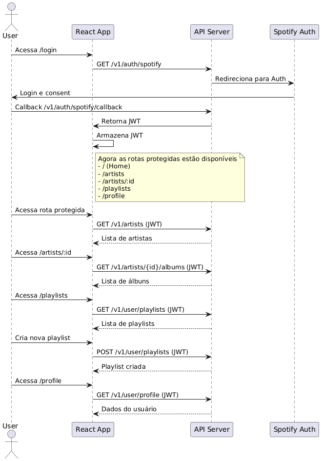

# 🎧 Spotify Clone - React + Node + Spotify API

Este projeto é uma aplicação fullstack que simula uma integração com a **API do Spotify**, permitindo login com autenticação OAuth, listagem de artistas, álbuns, playlists e perfil do usuário.

---

## 🧩 Arquitetura



---

## 🚀 Tecnologias Utilizadas

- **Frontend:** React + Vite + Redux Toolkit + Material UI  
- **Backend:** Node.js + Fastify + JWT  
- **Integração:** Spotify Web API  
- **Code Quality:** Biome (lint + format)  
- **Git Hooks:** Husky + Commitlint (Conventional Commits)

---

## 🛠️ Como rodar o projeto localmente

### 1. Clonar o repositório

```bash
git https://github.com/alexandremsouza1/magalu_challange.git
cd magalu_challange
```

### 2. Instalar dependências

#### Frontend
```bash
cd frontend
npm install
```

#### Backend
```bash
cd ../backend
npm install
```

### 3. Criar arquivos `.env`

#### Backend (`backend/.env`):
```env
SPOTIFY_CLIENT_ID=seu_client_id
SPOTIFY_CLIENT_SECRET=seu_client_secret
SPOTIFY_REDIRECT_URI=http://localhost:4000/v1/auth/spotify/callback
JWT_SECRET=sua_chave_jwt
PORT=4000
```

#### Frontend (`frontend/.env`):
```env
VITE_API_URL=http://localhost:4000
```

### 4. Rodar localmente

#### Backend
```bash
cd backend
npm run dev
```

#### Frontend
```bash
cd ../frontend
npm run dev
```

Acesse o app em: **http://localhost:5173**

---

## 🐳 Rodando com Docker

Certifique-se de ter o **Docker** e **Docker Compose** instalados.

```bash
docker-compose up -d
```

Isso irá subir os containers do **frontend** e **backend** automaticamente.

---

# 🧹 Qualidade de Código

O projeto utiliza **Biome**, **Husky** e **Commitlint** para manter a padronização e qualidade do código.

## Vantagens de Usar Biome, Husky e Commitlint

### **Biome**
- **Padronização de código**: Garante que todo o código siga o mesmo estilo e convenções, facilitando a leitura e manutenção por diferentes desenvolvedores
- **Detecção de code smells**: Identifica problemas no código como variáveis não utilizadas, código duplicado, complexidade excessiva e outros padrões que podem indicar problemas de design
- **Formatação automática**: Formata o código automaticamente de acordo com regras predefinidas, eliminando debates sobre espaçamento, indentação e quebras de linha
- **Performance**: Ferramenta extremamente rápida, escrita em Rust, que executa linting e formatação de forma eficiente
- **Tudo-em-um**: Combina funcionalidades de linter e formatter em uma única ferramenta, reduzindo a complexidade da configuração

### **Husky**
- **Automatização de verificações**: Executa scripts automaticamente em momentos-chave do Git (pre-commit, pre-push), garantindo que o código seja validado antes de ser commitado
- **Prevenção de erros**: Impede que código com problemas de formatação, linting ou testes falhando seja enviado ao repositório
- **Padronização do workflow**: Garante que todos os desenvolvedores do time executem as mesmas verificações, independentemente de suas configurações locais
- **Melhoria da qualidade**: Reduz significativamente a quantidade de code smells e problemas que chegam ao repositório principal

### **Commitlint**
- **Padronização de mensagens de commit**: Força um padrão consistente para mensagens de commit (ex: Conventional Commits), facilitando a geração de changelogs e o entendimento do histórico
- **Rastreabilidade**: Mensagens padronizadas tornam mais fácil identificar o que foi alterado, por que e por quem
- **Automação de releases**: Permite a geração automática de versões e changelogs baseados nas mensagens de commit
- **Melhor comunicação**: Commits bem estruturados melhoram a comunicação entre membros da equipe e facilitam code reviews

### **Benefícios Combinados**
- **Qualidade consistente**: A combinação dessas ferramentas cria uma barreira de qualidade que previne code smells e mantém o código limpo
- **Redução de débito técnico**: Problemas são identificados e corrigidos antes de se acumularem
- **Onboarding facilitado**: Novos desenvolvedores automaticamente seguem os padrões do projeto
- **Menos conflitos em code review**: Com código padronizado e formatado automaticamente, as revisões focam na lógica, não no estilo

### Instalar e configurar (já incluso no projeto)

```bash
npm install
npm run prepare
```

### Lint e Format

```bash
npm run lint
npm run format
```

### Conventional Commits

Os commits seguem o padrão **Conventional Commits**[https://www.conventionalcommits.org/].

---

## 📂 Estrutura do Projeto

A arquitetura do projeto segue o padrão do framework Fastify no backend e Vite no frontend, com uma separação clara entre camadas de serviço, controle e roteamento.


## 💡 Autor

**Alexandre Magno**  
Desenvolvido com ❤️ usando React, Node.js e a API do Spotify.

---

## 📄 Licença

Este projeto está licenciado sob a [MIT License](LICENSE).
